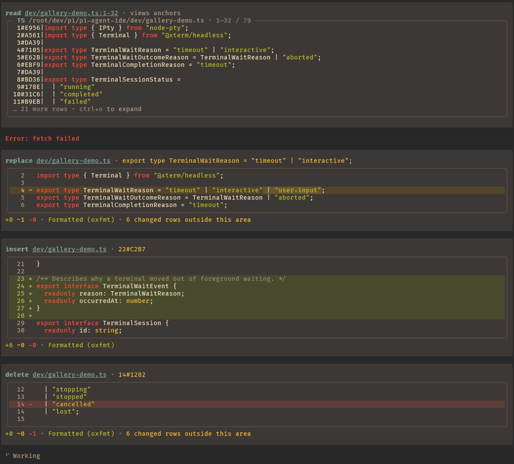
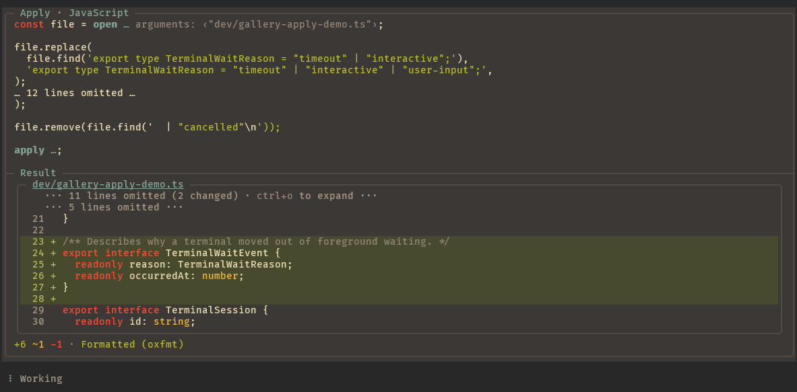
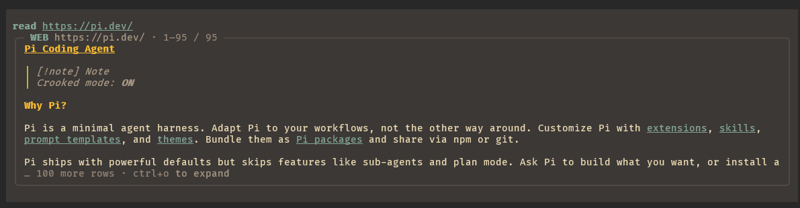
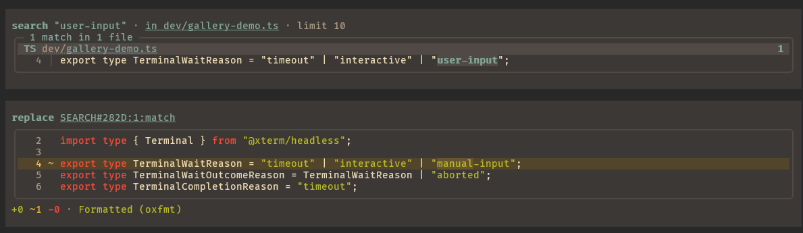
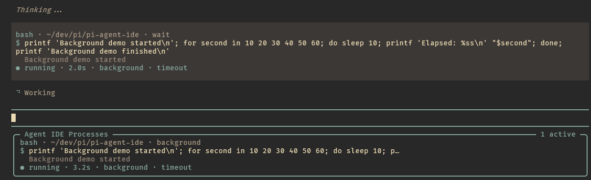
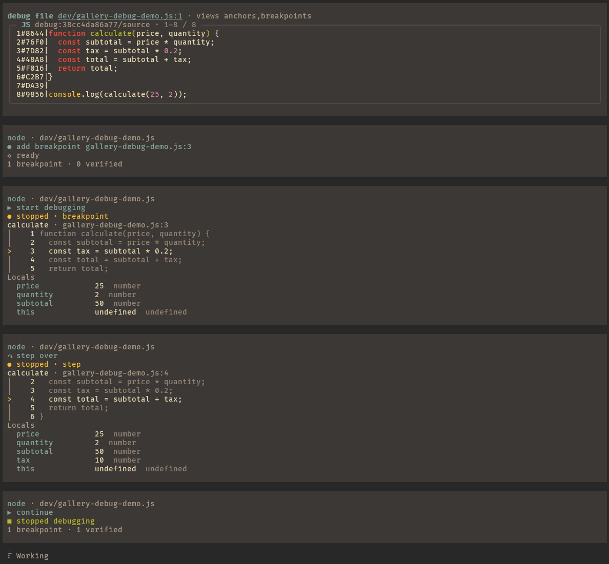

<p align="center">
  
</p>

<h1 align="center">Pi Agent IDE</h1>

<p align="center">Pi Agent IDE is an agent-native IDE extension for the <a href="https://pi.dev/">Pi coding agent</a>. It adds guarded editing, code search, AST/LSP navigation, persistent terminals, debugging, transactional changes, and observability tools.</p>

<p align="center">
  <a href="https://www.npmjs.com/package/pi-agent-ide"></a>
  <a href="https://www.npmjs.com/package/pi-agent-ide"></a>
  <a href="https://github.com/alexshpunt/pi-agent-ide/actions/workflows/ci.yml"></a>
  <a href="https://github.com/alexshpunt/pi-agent-ide/actions/workflows/ci.yml"></a>
  <a href="https://github.com/alexshpunt/pi-agent-ide/actions/workflows/ci.yml"></a>
  <a href="https://alexshpunt-benchmark-explorer.static.hf.space/?filter.harness=pi-agent-ide&amp;card=harness%3Api-agent-ide%40latest"></a>
  <a href="./LICENSE"></a>
</p>

## Summary

Pi Agent IDE is a set of agent-facing tools built to give a coding agent the same practical capabilities that a programmer expects from an IDE.

There are two common views of coding agents. One says that an agent only needs a shell and can build everything else for itself. The other says that useful tooling makes an agent more effective. Both are partly right. Stronger models can often make precise edits and recover with little help. Smaller models are more likely to lose context, choose an unsafe edit, or fail on the mechanics of the task. Pi Agent IDE gives models direct tools without taking the shell away.

The project started as another take on hash-based editing. It later brought back edits by exact string occurrence, with every occurrence checked before a change is applied. The result is a hybrid approach rather than one required selection method.

## Gallery

| Read and guarded tool editing                                                                                               | Transactional Apply                                                                                                   |
| --------------------------------------------------------------------------------------------------------------------------- | --------------------------------------------------------------------------------------------------------------------- |
|  |                         |
| Web reading                                                                                                                 | Search and replace                                                                                                    |
|                                        |                   |
| Background processes                                                                                                        | Source-level debugging                                                                                                |
|                    |  |

## Core principles

### One interface for each intent

The agent should express what it wants to do without choosing a different tool for every implementation behind it.

`read` is the main interface to the environment. It reads text, source code, raw bytes, web pages, images, PDFs, terminal sessions, debugger sessions, and diagnostics. The same interface can ask for AST structure, language-server information, anchors, or other views. The agent chooses the information it needs while the parsing, conversion, and resource handling stay behind one facade.

`search` follows the same rule. It searches files, text, symbols, syntax trees, and supported live resources through one interface.

Editing tools state concrete intentions such as `write`, `replace`, `insert`, `delete`, `copy`, and `move`. Simple edits use guarded operations that verify the selected text or resource. Independent edits can be submitted together as a tool-call batch. For conditional or multi-file work, `apply` gives the agent isolated JavaScript over immutable file snapshots and the same guarded editing model, then validates and commits the staged changes as one transaction. This lets models use scripts for complex work without reducing an edit to an unchecked rewrite.

### IDE tools

The shell remains available, but it behaves like part of an IDE. The agent can start long-running and interactive processes, leave them in the background, reconnect after an extension reload, and receive completion or stale-process notifications. Aborting an agent turn does not kill the process.

Debugger sessions are also addressable resources. The agent can set breakpoints, inspect source and variables, step through a program, and reconnect after a reload. Formatting, diagnostics, AST views, language-server views, terminal output, and debugger state work through the same resource model. This support is currently focused on Linux and WSL.

### Extensible by protocol

The visible tools stay small because their internals are protocols. HTTP reads, filesystem reads, terminal and debugger resources, file formats, AST views, language-server views, converters, search backends, anchors, formatters, and diagnostics can be added or replaced independently.

The goal is simple primitives on the outside and composable complexity on the inside. New capabilities should extend an existing intent-shaped interface instead of adding another one-off tool.

### Make recovery cheap

Agents can edit through exact strings, hash anchors, search results, AST matches, and language-server symbols. If one method fails, the tool explains why, shows the available alternatives, and points the agent to a more precise method. The goal is not to punish a bad selection with stricter guardrails. Smaller models will make mistakes. Recovery should cost as little time and context as possible.

The tools are designed to combine. A common flow is `search` followed by `replace`: the agent finds the intended occurrences, then edits all selected matches in one guarded operation. The same model supports structural changes and renames through search, AST, and LSP without requiring a separate workflow for each one.

### Observability

Powerful agents still need to be observable. A person should be able to see whether the harness is efficient, whether the agent is solving the real task, which tools fit its work, and where weak points or corner cases appear.

This is more than presentation. Observable behavior provides the evidence that drives tool design, regression fixes, and benchmark work.

### Data-driven development

Daily use and judgement still matter, but features should not be built on vibes alone. Changes are measured on real tasks to find where agents fail, which model families work better or worse with the tools, and how Pi Agent IDE compares with other harnesses.

The [Explicit Edit Benchmark](https://github.com/alexshpunt/explicit-edit-benchmark) was created for this purpose. It measures how easily agents can use editing tools on exact, deterministic tasks. These tasks are especially useful for smaller models and models with limited reasoning, where tool design has a larger effect on reliability.

Version 0.5.1 scores **93.8%** on `gpt-5.6-luna` with low reasoning: 224 of the 226 tasks solved
in the end, 208 of them on the first attempt. The full observation, including the two tasks it
did not solve, is in the [published data](https://huggingface.co/datasets/alexshpunt/explicit-edit-benchmark).

Agent results are stochastic and no benchmark captures everything. We publish the score we actually get and build broader statistics instead of selecting only favorable runs.

Pi Agent IDE is experimental and under active development. Interfaces and behavior may change.

## Customization

Pi Agent IDE follows Pi's permissive, YOLO-style default: the agent can use the tools without asking for approval at every step. You can make it as strict as your work requires.

- [Settings](./docs/configuration.md) control built-in tools, project mappings, search, and presentation.
- [File hooks](./docs/user-hooks.md) can inspect, change, or deny reads and edits.
- [Extensions](./docs/extensions.md) can add or replace protocols, resolvers, anchors, search backends, and other behavior.

## Installation

Install [Pi](https://pi.dev/) first, then install Pi Agent IDE:

```bash
pi install npm:pi-agent-ide
```

Pi packages run with your full system permissions. Review the package before installing it.

## Check project tools

Pi Agent IDE includes formatter, linter, LSP, and debugger mappings. It finds each tool from the project that owns the file, including project-local binaries and commands on your `PATH`. Settings from one project do not leak into another.

Start Pi in your project directory, then run:

```text
/pi-agent-ide-doctor
```

Doctor checks the effective project, global, and built-in mappings. It reports each applicable ID, its source layer and command, and the real probe result. It also checks AST support, search, and Git.

Doctor shows its report before changing anything. If project evidence points to a different installed tool, it can write a project-only override under `.pi/pi-agent-ide/`. It never changes global or built-in configuration. Native files such as `eslint.config.js`, `.clang-format`, and `pyproject.toml` remain unchanged.

Doctor also reports optional system Chrome/Chromium support for browser-rendered web reads. When setup still needs work, you can ask the agent to finish it; doctor runs the checks again afterward.

Run doctor again after installing or changing project tools. For configuration paths, precedence, and command flags, see [Configuration](./docs/configuration.md#doctor).

## Feedback and contributions

Pi Agent IDE is used actively in real development, but I can only reproduce the models, tools, environments, and workflows available to me. Everyone works differently, and I cannot find or cover every case on my own. I can fix problems when I encounter them or when someone reports them.

If something breaks, behaves badly, or does not fit your workflow, please [open an issue](https://github.com/alexshpunt/pi-agent-ide/issues). Bug reports, ideas, and questions are welcome. Pull requests are welcome too. Every contribution will be considered, and I am fully open to making the project much better with help from its users.

## Documentation

| Document                                   | Contents                                                             |
| ------------------------------------------ | -------------------------------------------------------------------- |
| [Tools and workflow](./docs/tools.md)      | Read, search, editing, anchors, and feedback                         |
| [Architecture](./docs/architecture.md)     | Module boundaries, protocols, and the umbrella extension             |
| [Configuration](./docs/configuration.md)   | Run doctor, configure project tools and search, or disable built-ins |
| [File hooks](./docs/user-hooks.md)         | Inspect, change, or deny reads and edits                             |
| [Writing extensions](./docs/extensions.md) | Add resolvers, anchors, search backends, and IDE plugins             |
| [Development](./docs/development.md)       | Work from a checkout, test, and run modular mode                     |

## License

[MIT](./LICENSE)
