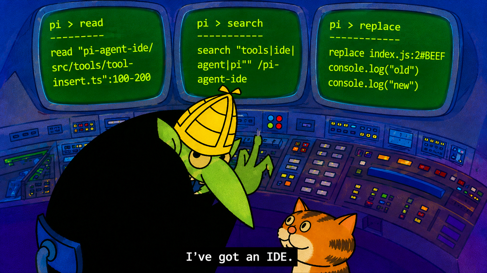

<p align="center">
  
</p>

<h1 align="center">Pi Agent IDE</h1>

<p align="center">Agent-facing tools for reading, searching, and editing code in <a href="https://pi.dev/">Pi</a>.</p>

<p align="center">
  <a href="https://www.npmjs.com/package/pi-agent-ide"></a>
  <a href="https://www.npmjs.com/package/pi-agent-ide"></a>
  <a href="https://github.com/alexshpunt/pi-agent-ide/actions/workflows/ci.yml"></a>
  <a href="https://github.com/alexshpunt/pi-agent-ide/actions/workflows/ci.yml"></a>
  <a href="https://github.com/alexshpunt/pi-agent-ide/actions/workflows/ci.yml"></a>
  <a href="./LICENSE"></a>
</p>

## Status

Pi Agent IDE is experimental and under active development. It is used in real work, but bugs and rough edges are still being found and fixed. Interfaces and behavior may change.

The current focus is measurement. The project is being compared with vanilla Pi on evals and editing gyms to understand where its tools improve results or reduce tool use and token use. Some workflows already benefit from the tools; others become harder. Until the data is stronger, treat performance claims as unproven and use the package at your own risk.

## What it does

Pi Agent IDE provides a small set of tools with more specialized behavior behind them:

- `read` handles files, web pages, images, PDFs, code views, and diagnostics;
- `search` routes text and structural searches;
- `write`, `replace`, `insert`, `delete`, `copy`, and `move` cover common text mutations; range-based edits can target snapshot and semantic anchors instead of reproducing the `oldText` block required by Pi's built-in `edit` tool;
- optional plugins add AST, LSP, formatting, linting, and Git-aware behavior;
- `/pi-agent-ide-doctor` detects project languages and lets each loaded plugin check or configure its own scope.

The public interface is intentionally small. Resources, resolvers, anchors, renderers, and toolchain integrations are connected through versioned plugin protocols. The npm package loads as one Pi extension, while its built-ins remain separate modules that can be replaced or extended.

## Installation

Install [Pi](https://pi.dev/) first, then install Pi Agent IDE:

```bash
pi install npm:pi-agent-ide
```

Pi packages run with your full system permissions. Review the package before installing it.

## Check project tools

Pi Agent IDE includes formatter, linter, and LSP mappings. It runs their external commands through your current `PATH`, so projects work without copied IDE config files when those commands are installed.

Start Pi in your project directory, then run:

```text
/pi-agent-ide-doctor
```

Doctor checks the effective project, global, and built-in mappings. It reports each applicable ID, its source layer and command, and the real probe result. It also checks AST support, search, and Git.

Doctor shows its report before changing anything. If project evidence points to a different installed tool, it can write a project-only override under `.pi/pi-agent-ide/`. It never changes global or built-in configuration. Native files such as `eslint.config.js`, `.clang-format`, and `pyproject.toml` remain unchanged.

Doctor also reports optional system Chrome/Chromium support for browser-rendered web reads. When setup still needs work, you can ask the agent to finish it; doctor runs the checks again afterward.

Run doctor again after installing or changing project tools. For configuration paths, precedence, and command flags, see [Configuration](./docs/configuration.md#doctor).

## Documentation

| Document                                   | Contents                                                             |
| ------------------------------------------ | -------------------------------------------------------------------- |
| [Tools and workflow](./docs/tools.md)      | Read, search, editing, anchors, and feedback                         |
| [Architecture](./docs/architecture.md)     | Module boundaries, protocols, and the umbrella extension             |
| [Configuration](./docs/configuration.md)   | Run doctor, configure project tools and search, or disable built-ins |
| [Writing extensions](./docs/extensions.md) | Add resolvers, anchors, search backends, and IDE plugins             |
| [Development](./docs/development.md)       | Work from a checkout, test, and run modular mode                     |
| [Evaluation](./docs/evaluation.md)         | Compare Pi Agent IDE with vanilla Pi on repeatable tasks             |

## Repository

Executable behavior is defined by the source and tests. The documents above explain the intended boundaries, extension contracts, and development workflows.

## License

[MIT](./LICENSE)
