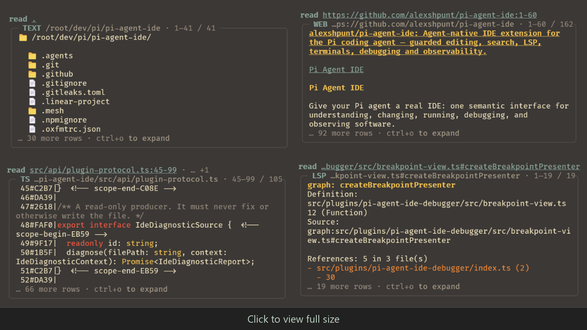
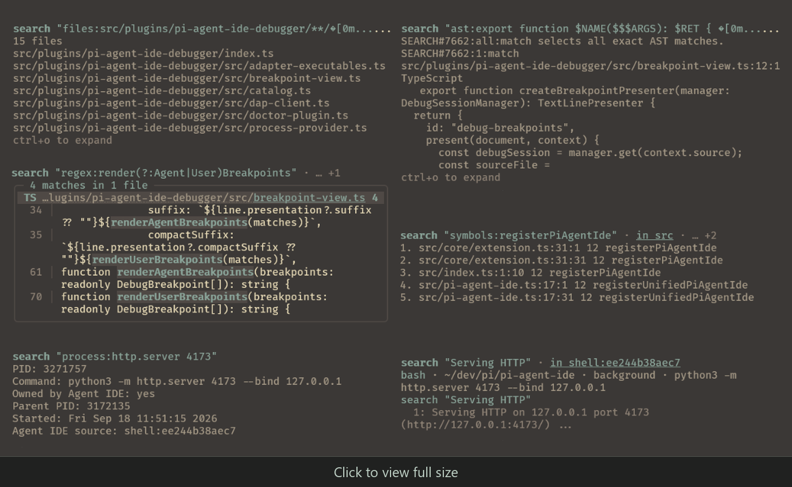
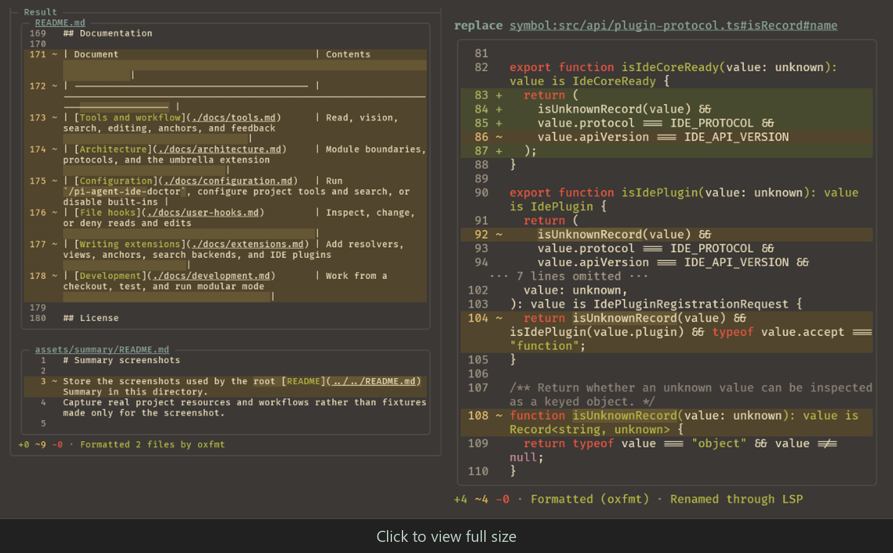
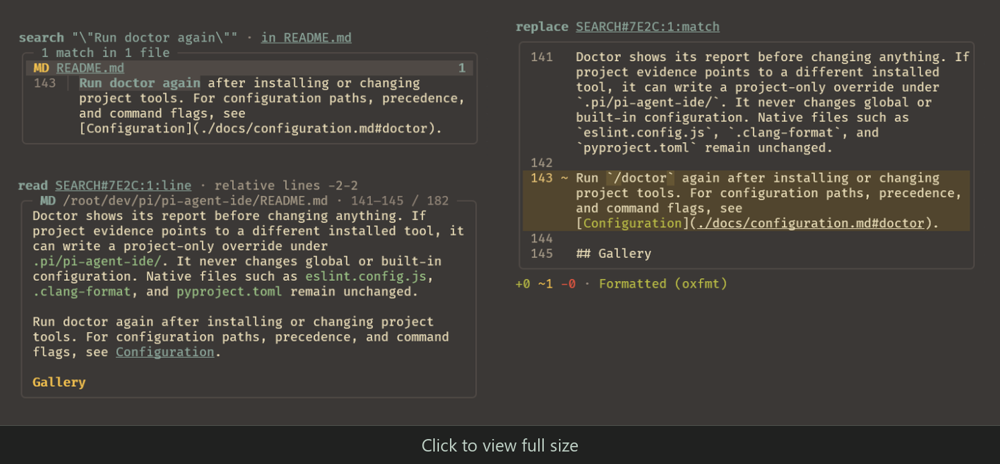
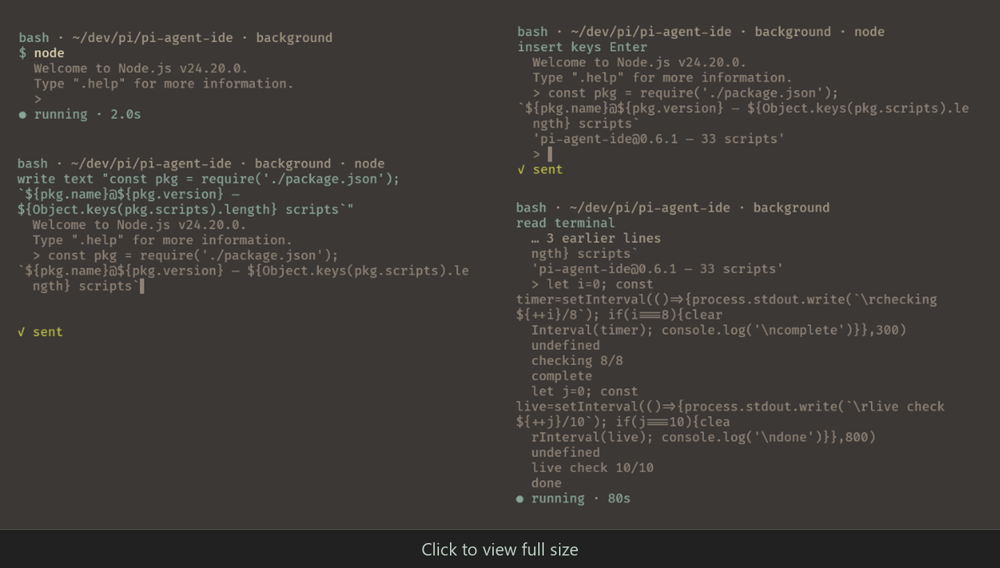
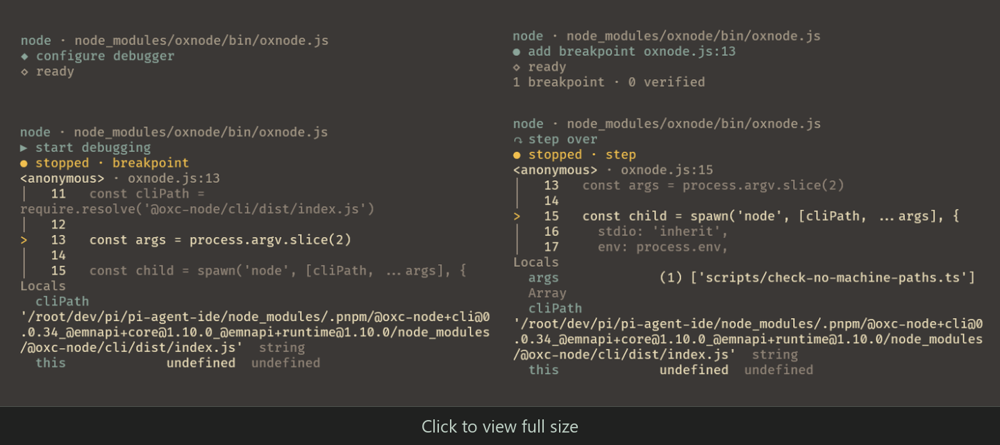
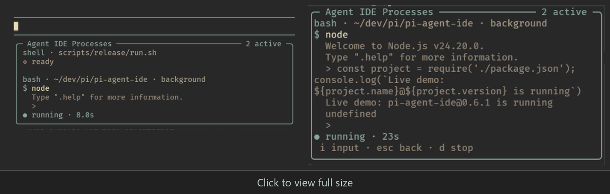
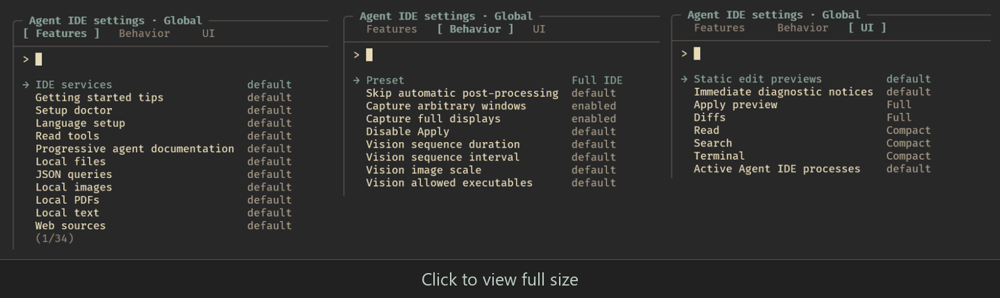

<p align="center">
  
</p>

<h1 align="center">Pi Agent IDE</h1>

<p align="center">Give your Pi agent a real IDE: one semantic interface for understanding, changing, running, debugging, and observing software.</p>

<div align="center">

[](https://www.npmjs.com/package/pi-agent-ide)
[](https://www.npmjs.com/package/pi-agent-ide)
[](https://github.com/alexshpunt/pi-agent-ide/actions/workflows/ci.yml)
[](./LICENSE)

</div>

<div align="center">

[](https://github.com/alexshpunt/pi-agent-ide/actions/workflows/ci.yml)
[](https://github.com/alexshpunt/pi-agent-ide/actions/workflows/ci.yml)

</div>

<div align="center">

[](https://huggingface.co/spaces/alexshpunt/benchmark-explorer?card=harness%3Api-agent-ide%40latest)

</div>

## Summary

Pi Agent IDE gives the [Pi coding agent](https://pi.dev/) a unified set of first-class development tools. Each tool represents an intent instead of one particular implementation. The agent uses the same small set of semantic interfaces across files, source code, terminals, debuggers, web pages, images, processes, application windows, and displays.

The interfaces are designed to combine. A search result can become an edit selection. A running process can become a terminal, debugger, or visual resource. A source read can expose anchors, syntax, diagnostics, or language-server information without sending the agent through a separate workflow for each capability.

### Read anything through `read`

`read` is one interface for inspecting:

- files, directories, source code, and raw bytes;
- JSON transformed through real `jq` filters;
- web pages, PDFs, images, and image sequences;
- diagnostics and Git changes;
- terminal and debugger sessions;
- running processes, application windows, and full displays.

Views change how the same resource is presented. The agent can request source structure, editable anchors, diagnostics, an image, a sequence, or another supported projection without learning a separate tool for every source.

<div align="center">

[](assets/summary/read.png)

</div>

### Find anything through `search`

`search` provides one interface for paths, exact text, regular expressions, AST patterns, symbols, references, code relationships, process discovery, and retained terminal output. Results are reusable guarded references, so the agent can find an intended target once and pass that selection directly to `read` or an editing tool.

<div align="center">

[](assets/summary/search.png)

</div>

### Express edits as intentions

Editing uses direct semantic operations:

- `write` creates a file or deliberately replaces its complete contents;
- `replace` changes selected text;
- `insert` adds text around a selection;
- `delete` removes selected text or a resource;
- `copy` and `move` duplicate or relocate text and files;
- `undo` restores an edit or a complete transaction.

Independent edits can be submitted together as a tool-call batch. Conditional and multi-file work uses Apply, a code mode that exposes the same guarded operations through transactional JavaScript. Diffing and staging are first-class tools too.

<div align="center">

[](assets/summary/editing.png)

</div>

Selections can come from exact text, anchors, search results, AST matches, or language-server symbols. Stale, ambiguous, and failed operations do not apply silently. If one selection method is a poor fit, the agent can recover through another without throwing away the rest of its work.

<div align="center">

[](assets/summary/search-and-replace.png)

</div>

### Run through persistent terminal sessions

The terminal is a first-class cross-platform interface. The agent can run commands, keep interactive sessions and background tasks alive across turns and extension reloads, read retained output, send exact input or named keys, and inspect terminal applications through images and sequences.

<div align="center">

[](assets/summary/terminal.png)

</div>

### Debug programs interactively

Debugger sessions use the same resource model. The agent can set breakpoints, inspect stack frames and variables, evaluate expressions, step through execution, and return to a running session later.

<div align="center">

[](assets/summary/debugging.png)

</div>

### See the environment

The agent can render websites as images, observe changing interfaces over time, and inspect windows opened by its own processes. Arbitrary windows and full displays require separate explicit opt-in settings. Images can be downscaled, limited to normalized regions, or divided into grid cells so the model receives the useful area instead of every source pixel.

### Keep context focused through progressive disclosure

Pi Agent IDE does not load every capability guide into the system prompt. Detailed instructions are disclosed when the agent first uses the relevant tool and remain available as readable documentation through `read`.

The agent receives the complete contract when it needs it. Unrelated capabilities do not consume context throughout the rest of the task, and large results remain progressively readable instead of flooding the context or terminal.

### Extend the interfaces through protocols

Filesystem and HTTP reads, resource views, content converters, search backends, anchors, formatters, diagnostics, terminals, and debugger resources are independent protocols behind the public tools. Extensions can add or replace those capabilities without creating another one-off interface for the agent. See [Writing extensions](./docs/extensions.md).

### Observe the work and recover cheaply

A person can see the agent's edits, diffs, diagnostics, running processes, debugger state, and failures. Bounded presentation keeps live output readable without discarding the underlying result. Guarded snapshots and first-class undo make mistakes visible and recovery inexpensive.

<div align="center">

[](assets/summary/user_terminal.png)

</div>

### Work across languages and platforms

Built-in debugger recipes cover C, C++, C#, Dart, Elixir, Go, Java, JavaScript, Julia, Kotlin, Lua, PHP, PowerShell, Python, R, Ruby, Rust, shell scripts, Swift, TypeScript, and Zig. Formatting, linting, AST, language-server, and debugger support follows the tools and configuration available in each project.

Windows and WSL are first-class supported environments alongside Linux. Run `/pi-agent-ide-doctor` to see the exact capabilities available on the current machine.

### Built through data-driven development

Pi Agent IDE is developed through daily use on real software and measured with the [Explicit Edit Benchmark](https://github.com/alexshpunt/explicit-edit-benchmark). Every release is exercised against real editing tasks, and the measured result becomes part of the release evidence. The badge above links to the [latest accepted observation](https://huggingface.co/spaces/alexshpunt/benchmark-explorer?card=harness%3Api-agent-ide%40latest), with its score and run details; the underlying observations are available in the [published dataset](https://huggingface.co/datasets/alexshpunt/explicit-edit-benchmark).

The project is also used to develop itself. Weak interactions, missing affordances, and agent failure modes appear in real work instead of remaining theoretical. Problems are fixed as they are found, and the tools evolve through regular releases.

Pi Agent IDE is experimental and under active development. Interfaces and behavior may change.

## Installation

Install [Pi](https://pi.dev/) first, then install Pi Agent IDE from npm:

```bash
pi install npm:pi-agent-ide
```

Or install it directly from GitHub:

```bash
pi install git:github.com/alexshpunt/pi-agent-ide
```

To pin a Git installation, append a release tag or commit. To try the package for one session without adding it to your settings:

```bash
pi -e npm:pi-agent-ide
```

Pi packages run with your full system permissions. Review the package before installing it.

## Check project tools

Pi Agent IDE includes formatter, linter, LSP, and debugger mappings. It discovers each tool from the project that owns the file, including project-local binaries and commands on your `PATH`. Settings from one project do not leak into another.

Start Pi in your project directory, then run:

```text
/pi-agent-ide-doctor
```

Doctor reports the effective project, global, and built-in mappings, their source layers and commands, and the real probe results. It also checks AST support, search, Git, and optional Chrome or Chromium support for browser-rendered web reads.

Doctor shows its report before changing anything. If project evidence points to a different installed tool, it can write a project-only override under `.pi/pi-agent-ide/`. It never changes global or built-in configuration. Native files such as `eslint.config.js`, `.clang-format`, and `pyproject.toml` remain unchanged.

Run `/pi-agent-ide-doctor` again after installing or changing project tools. For configuration paths, precedence, and command flags, see [Configuration](./docs/configuration.md#doctor).

## Customization

Pi Agent IDE follows Pi's permissive, YOLO-style default: the agent can use the tools without asking for approval at every step. You can make it as strict as your work requires.

- [Settings](./docs/configuration.md) control built-in tools, project mappings, search, vision, and presentation.
- [File hooks](./docs/user-hooks.md) can inspect, change, or deny reads and edits.
- [Extensions](./docs/extensions.md) can add or replace protocols, resolvers, views, anchors, search backends, and other behavior.

<div align="center">

[](assets/summary/settings.png)

</div>

## Feedback and contributions

Pi Agent IDE is used actively in real development, but I can only reproduce the models, tools, environments, and workflows available to me. Everyone works differently, and I cannot find or cover every case on my own.

If something breaks, behaves badly, or does not fit your workflow, please [open an issue](https://github.com/alexshpunt/pi-agent-ide/issues). Bug reports, ideas, questions, and pull requests are welcome.

## Documentation

| Document                                   | Contents                                                                             |
| ------------------------------------------ | ------------------------------------------------------------------------------------ |
| [Tools and workflow](./docs/tools.md)      | Read, vision, search, editing, anchors, and feedback                                 |
| [Architecture](./docs/architecture.md)     | Module boundaries, protocols, and the umbrella extension                             |
| [Configuration](./docs/configuration.md)   | Run `/pi-agent-ide-doctor`, configure project tools and search, or disable built-ins |
| [File hooks](./docs/user-hooks.md)         | Inspect, change, or deny reads and edits                                             |
| [Writing extensions](./docs/extensions.md) | Add resolvers, views, anchors, search backends, and IDE plugins                      |
| [Development](./docs/development.md)       | Work from a checkout, test, and run modular mode                                     |

## License

[MIT](./LICENSE)
