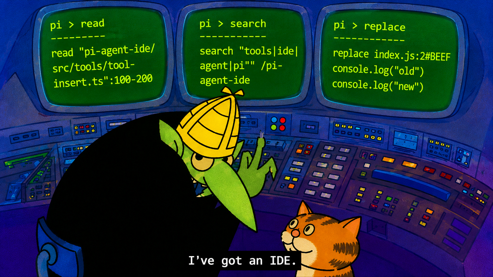
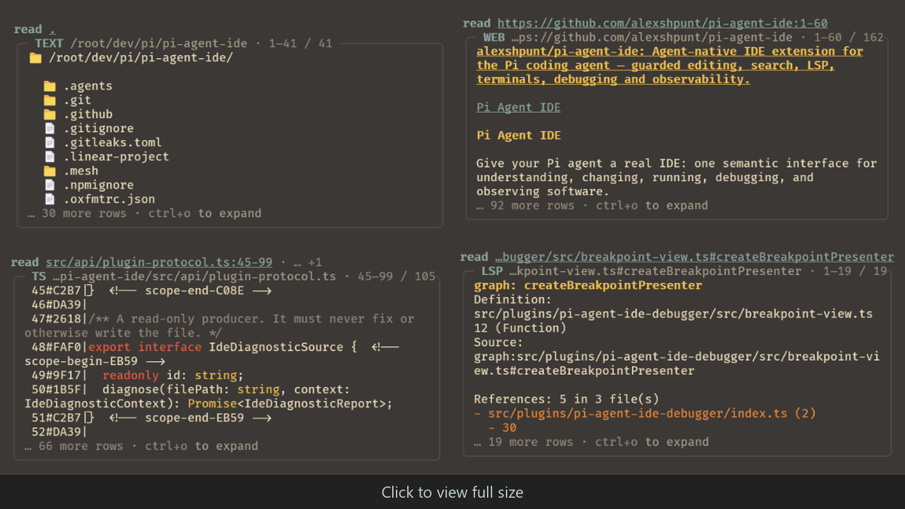
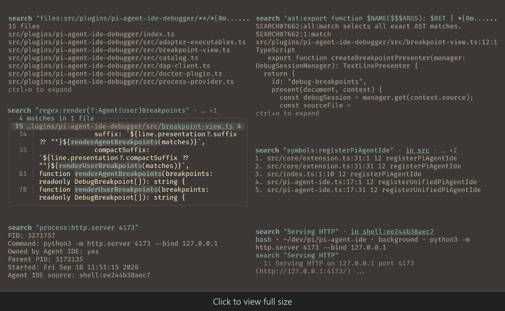
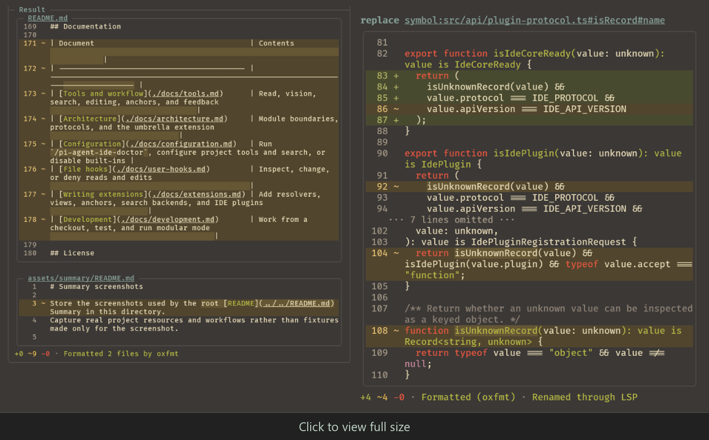
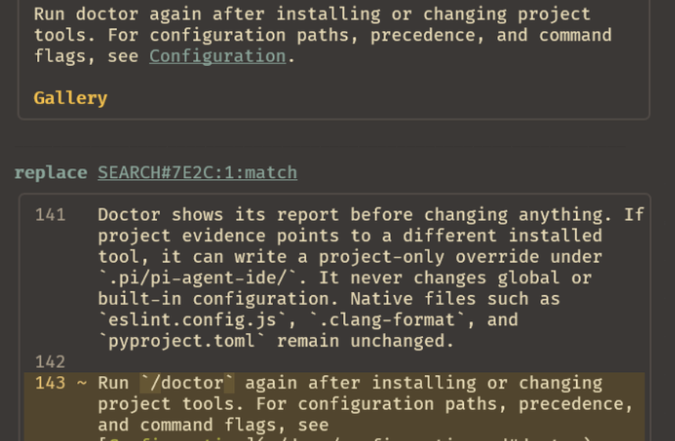
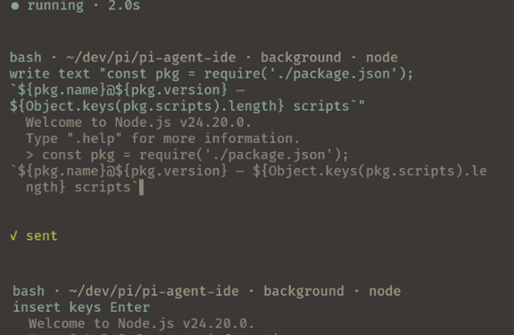
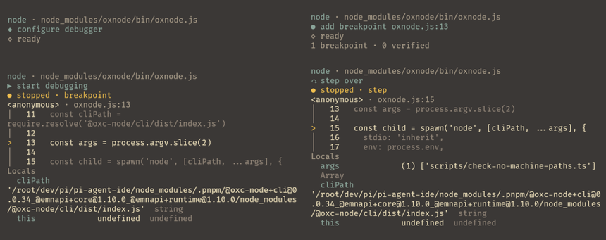
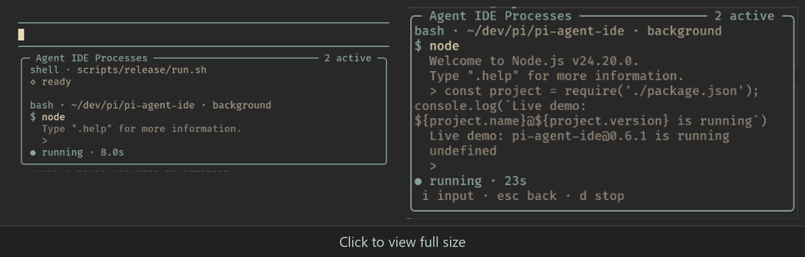
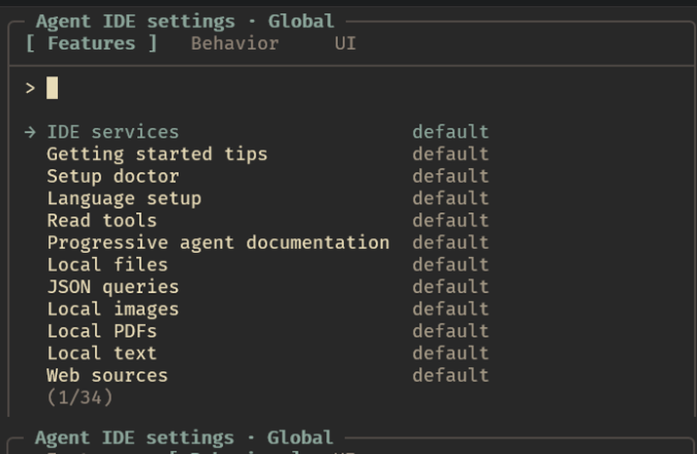

<p align="center">
  
</p>

<h1 align="center">Pi Agent IDE</h1>

<p align="center">Give your Pi agent a real IDE: one semantic interface for understanding, changing, running, debugging, and observing software.</p>

<div align="center">

[](https://www.npmjs.com/package/pi-agent-ide)
[](https://www.npmjs.com/package/pi-agent-ide)
[](https://github.com/alexshpunt/pi-agent-ide/actions/workflows/ci.yml)
[](./LICENSE)

</div>

<div align="center">

[](https://github.com/alexshpunt/pi-agent-ide/actions/workflows/ci.yml)
[](https://github.com/alexshpunt/pi-agent-ide/actions/workflows/ci.yml)

</div>

<div align="center">

[](https://huggingface.co/spaces/alexshpunt/benchmark-explorer?card=harness%3Api-agent-ide%40latest)

</div>

## Summary

Pi Agent IDE gives the [Pi coding agent](https://pi.dev/) a small set of development tools for understanding, changing, running, debugging, and observing software. The same tools work with local resources and configured Linux SSH targets.

The tools work together in both direct calls and Pi's native Codemode. The agent can carry a search result into a precise edit instead of reading the file again and guessing a location. You see the same readable tool panels and diffs in either mode.

| Work                                 | Interfaces                                                    |
| ------------------------------------ | ------------------------------------------------------------- |
| Inspect content and state            | `read` with source-specific views                             |
| Find text, paths, code and processes | `search`                                                      |
| Derive exact text and AST selections | `select`                                                      |
| Change text and filesystem objects   | `write`, `replace`, `insert`, `delete`, `copy`, `move`        |
| Compare, stage and restore changes   | `diff`, `stage`, `unstage`, `undo`                            |
| Run and interact with commands       | `bash` or `powershell`, then `shell:` resources               |
| Debug programs                       | `debug`, then `debug:` resources                              |
| Work remotely                        | The same supported tools with `ssh://` paths and remote `cwd` |

### Combine tools through direct calls or native Codemode

All IDE tools support direct calls and Pi's built-in Codemode. The agent can combine reading, search, selection and editing into one workflow, with the same source checks and visible results in both modes.

For example, this script finds a checklist item, selects its complete line, and marks it done:

```js
const source = await tools.read({ path: "notes.md" });
const matches = await tools.search({ path: source, query: "- [ ] Update docs" });
const lines = await tools.select({ path: matches, operation: { kind: "linesOf" } });
text(await tools.replace({ path: lines, text: "- [x] Update docs\n" }));
```

### Read anything through `read`

`read` is one interface for inspecting:

- files, directories, source code, and raw bytes;
- JSON transformed through real `jq` filters;
- web pages, PDFs, images, and image sequences;
- diagnostics and Git changes;
- terminal and debugger sessions;
- running processes, application windows, and full displays.

Views change how the same resource is presented. The agent can request source structure, editable anchors, diagnostics, an image, a sequence, or another supported projection without learning a separate tool for every source.

<div align="center">

[](assets/summary/read.png)

</div>

### Find anything through `search`

`search` provides one interface for paths, exact text, regular expressions, AST patterns, symbols, references, code relationships, process discovery, and retained terminal output. Results are reusable guarded references, so the agent can find an intended target once and pass that selection directly to `read` or an editing tool.

<div align="center">

[](assets/summary/search.png)

</div>

### Select and change exactly what you mean

`select` helps the agent change the intended part of a file: a line, a function body, a parameter list, or the overlap between selections. JavaScript and TypeScript structure is supported without JSX/TSX, so the agent can work with code boundaries rather than guessing line numbers.

Language-server support adds declarations, references, call graphs, diagnostics, and semantic rename across references. Available features depend on the project's language server. See [selection](docs/agent-guides/select-code.md) and [code navigation](docs/agent-guides/search-code.md).

### Review edits against your own rules

Optional [Jev code review](docs/code-review.md) checks small saved diffs against natural-language YAML rules you supply. It delivers background hints without replacing normal diagnostics. A separately enabled skill helps turn your review feedback into proposed rules, saved only after confirmation. Both features are off by default.

### Express edits as intentions

Editing uses direct semantic operations:

- `write` creates a file or deliberately replaces its complete contents;
- `replace` changes selected text;
- `insert` adds text around a selection;
- `delete` removes selected text or a resource;
- `copy` and `move` duplicate or relocate text, files, directory trees, and symlink objects;
- `undo` restores the last text edit or a selected Git change.

See [directory and symlink operations](docs/directory-operations.md) for merge/replace behavior, guards, and failure effects.

<div align="center">

[](assets/summary/editing.png)

</div>

Selections can come from exact text, anchors, search results, AST matches, or language-server symbols. Stale, ambiguous, and failed operations do not apply silently. If one selection method is a poor fit, the agent can recover through another without throwing away the rest of its work.

<div align="center">

[](assets/summary/search-and-replace.png)

</div>

### Review and restore Git changes

The agent can compare changes, stage or unstage individual Git changes, and restore a selected change without discarding the rest of the file. Text edits also have their own undo. You can see what changed and recover at the level of the operation, rather than resetting all the work.

### Run through persistent terminal sessions

The terminal is a first-class cross-platform interface. The agent can run commands, keep interactive sessions and background tasks alive across turns and extension reloads, read retained output, send exact input or named keys, and inspect terminal applications through images and sequences.

<div align="center">

[](assets/summary/terminal.png)

</div>

### Debug programs interactively

Debugger sessions use the same resource model. The agent can set breakpoints, inspect stack frames and variables, evaluate expressions, step through execution, and return to a running session later.

<div align="center">

[](assets/summary/debugging.png)

</div>

### See the environment

The agent can render websites as images, observe changing interfaces over time, and inspect windows opened by its own processes. Arbitrary windows and full displays require separate explicit opt-in settings. Images can be downscaled, limited to normalized regions, or divided into grid cells so the model receives the useful area instead of every source pixel.

### Use the same tools over SSH

Ask the agent to work on a remote Linux environment. It can read, search and edit files, copy between your machine and the server, work with Git, and run interactive commands through the same IDE tools. Language servers, linters, formatters and debugger adapters use the remote machine's tools and project settings.

Remote process inspection, supported window/display capture and remote web reads are available too. Missing remote dependencies are reported rather than silently replaced by local tools.

SSH uses your existing OpenSSH authentication and host-key trust. The remote machine needs Python 3; no permanent agent is installed there. Operations have the permissions of the SSH account. The agent sets up project-local access by default unless you ask for global settings. See [SSH configuration](docs/configuration.md#ssh-targets).

### Keep context focused through progressive disclosure

The agent gets detailed guides and optional tools when it needs them, instead of carrying every instruction throughout the task.

Large results stay readable without losing the full text or the exact source selection. Compact edit receipts keep the agent's context small while you still see the full diff. See [tools and workflow](docs/tools.md) for the details.

### Extend the interfaces through protocols

Filesystem and HTTP reads, resource views, content converters, search backends, anchors, formatters, diagnostics, terminals, and debugger resources are independent protocols behind the public tools. Extensions can add or replace those capabilities without creating another one-off interface for the agent. See [Writing extensions](./docs/extensions.md).

### Observe the work and recover cheaply

A person can see the agent's edits, diffs, diagnostics, running processes, debugger state, and failures. Bounded presentation keeps live output readable without discarding the underlying result. Guarded snapshots and first-class undo make mistakes visible and recovery inexpensive.

Direct calls and native Codemode both show tool panels and diffs. A batch of edits shows the final diff for each file rather than a stack of intermediate cards. These panels remain available when you restore a session or navigate its history.

<div align="center">

[](assets/summary/user_terminal.png)

</div>

### Work across languages and platforms

Built-in debugger recipes cover C, C++, C#, Dart, Elixir, Go, Java, JavaScript, Julia, Kotlin, Lua, PHP, PowerShell, Python, R, Ruby, Rust, shell scripts, Swift, TypeScript, and Zig. Formatting, linting, AST, language-server, and debugger support follows the tools and configuration available in each project.

Known issue: the Java/Kotlin adapter (`fwcd/kotlin-debug-adapter` 0.4.4) can run past verified breakpoints. This was reproduced with JDK 17 and 21 both locally and over SSH. Those recipes remain available, but a verified breakpoint is not proof that execution will stop there.

Windows and WSL are first-class supported environments alongside Linux. Run `/pi-agent-ide-doctor` to see the exact capabilities available on the current machine.

### Built through data-driven development

Pi Agent IDE is developed through daily use on real software and measured with the [Explicit Edit Benchmark](https://github.com/alexshpunt/explicit-edit-benchmark). Every release is exercised against real editing tasks, and the measured result becomes part of the release evidence. The badge above links to the [latest accepted observation](https://huggingface.co/spaces/alexshpunt/benchmark-explorer?card=harness%3Api-agent-ide%40latest), with its score and run details; the underlying observations are available in the [published dataset](https://huggingface.co/datasets/alexshpunt/explicit-edit-benchmark).

The project is also used to develop itself. Weak interactions, missing affordances, and agent failure modes appear in real work instead of remaining theoretical. Problems are fixed as they are found, and the tools evolve through regular releases.

Pi Agent IDE is experimental and under active development. Interfaces and behavior may change.

## Installation

Install [Pi](https://pi.dev/) **0.99.1 or newer** first, then install Pi Agent IDE from npm. Development and integration tests use Pi 1.0.0. Older hosts are rejected with an upgrade message.

```bash
pi install npm:pi-agent-ide
```

Or install it directly from GitHub:

```bash
pi install git:github.com/alexshpunt/pi-agent-ide
```

To pin a Git installation, append a release tag or commit. To try the package for one session without adding it to your settings:

```bash
pi -e npm:pi-agent-ide
```

Pi packages run with your full system permissions. Review the package before installing it.

## Check project tools

Pi Agent IDE includes formatter, linter, LSP, and debugger mappings. It discovers each tool from the project that owns the file, including project-local binaries and commands on your `PATH`. Settings from one project do not leak into another.

Start Pi in your project directory, then run:

```text
/pi-agent-ide-doctor
```

Doctor reports the effective project, global, and built-in mappings, their source layers and commands, and the real probe results. It also checks AST support, search, Git, and optional Chrome or Chromium support for browser-rendered web reads.

Doctor shows its report before changing anything. If project evidence points to a different installed tool, it can write a project-only override under `.pi/pi-agent-ide/`. It never changes global or built-in configuration. Native files such as `eslint.config.js`, `.clang-format`, and `pyproject.toml` remain unchanged.

For a configured remote project, use `/pi-agent-ide-doctor ssh://target/path`. Target checks use that machine's tools and settings; suggested overrides stay in that remote project.

Run `/pi-agent-ide-doctor` again after installing or changing project tools. For configuration paths, precedence, and command flags, see [Configuration](./docs/configuration.md#doctor).

## Customization

Pi Agent IDE follows Pi's permissive, YOLO-style default: the agent can use the tools without asking for approval at every step. You can make it as strict as your work requires.

- [Settings](./docs/configuration.md) control built-in tools, project mappings, search, vision, and presentation.
- [File hooks](./docs/user-hooks.md) can inspect, change, or deny reads and edits.
- [Extensions](./docs/extensions.md) can add or replace protocols, resolvers, views, anchors, search backends, and other behavior.

<div align="center">

[](assets/summary/settings.png)

</div>

## Feedback and contributions

Pi Agent IDE is used actively in real development, but I can only reproduce the models, tools, environments, and workflows available to me. Everyone works differently, and I cannot find or cover every case on my own.

If something breaks, behaves badly, or does not fit your workflow, please [open an issue](https://github.com/alexshpunt/pi-agent-ide/issues). Bug reports, ideas, questions, and pull requests are welcome.

## Documentation

| Document                                               | Contents                                                                 |
| ------------------------------------------------------ | ------------------------------------------------------------------------ |
| [Tools and workflow](./docs/tools.md)                  | Reading, search, selections, editing, terminals, and feedback            |
| [Result composition](./docs/structured-results.md)     | Passing results between tools, reference lifetime, and commit boundaries |
| [Selection](./docs/agent-guides/select-code.md)        | Text ranges, AST parts, and combining selections                         |
| [Directory operations](./docs/directory-operations.md) | Copy, Move, Delete, symlinks, guards, and partial failures               |
| [Configuration](./docs/configuration.md)               | Project tools, SSH targets, Doctor, and presentation settings            |
| [SSH guide](./docs/agent-guides/ssh.md)                | Agent setup and supported remote operations                              |
| [File hooks](./docs/user-hooks.md)                     | Inspect, change, or deny reads and edits                                 |
| [Writing extensions](./docs/extensions.md)             | Resolvers, views, anchors, search backends, and IDE plugins              |
| [Architecture](./docs/architecture.md)                 | Module boundaries, protocols, and the umbrella extension                 |
| [Development](./docs/development.md)                   | Checkout setup, tests, and modular mode                                  |
| [Releases](./docs/releases.md)                         | Nightly builds, release candidates, verification, and publication        |

## License

[MIT](./LICENSE)
